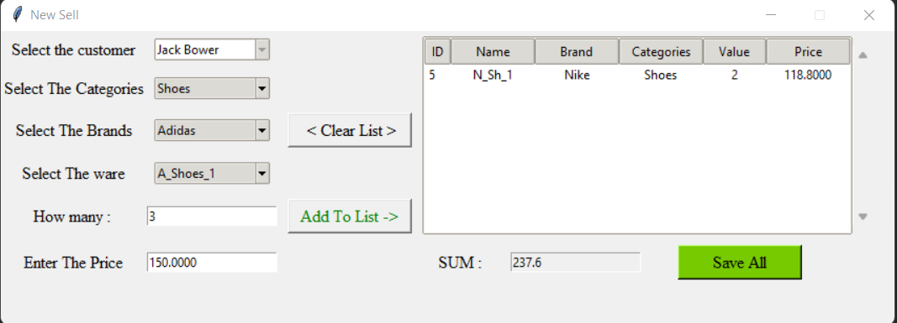

# Create $\color{Yellow}Docker$ and work with that

# $\color{red}Hello \space \color{lightblue}and \space \color{orange}Wellcome$

## This Project just for test and show how to create and work with docker
## Previously we made a program by Python to create and use sql and tkinter and manage that 

## [Here --> Click me](https://img.shields.io/github/last-commit/Masoud-Khosravi/SQLite)

## You can take a look :

 

# 
# Now we create a simple function for use that sql commands in docker

You can see Dockerfile in files for more explaination or 

## use this : 

 
 
 
 
 
 

## Other Repositories:

 
 

## $\color{red}About \space \color{orange}Me:$

 
 

   
  
  
  
   
  <a href="https://github.com/Masoud-Khosravi">
       
  <!---  
      
  -->
    
  </a>
  

